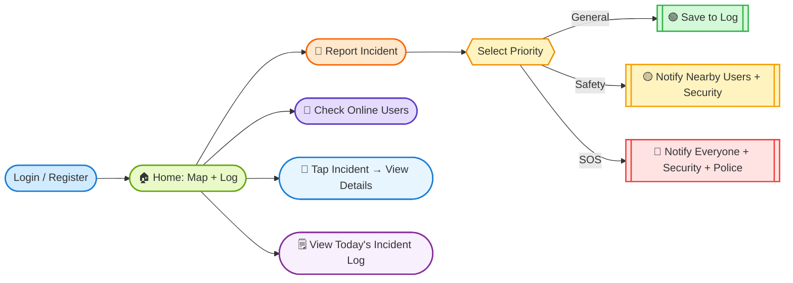

# 📱 SafePal - Campus Safety App

A mobile app built by students, for students. With this app, no one walks alone — safety is instant, community-driven, and always within reach.

## Overview

Campus safety has always been a concern, especially during late hours, isolated areas, or emergencies where help is not instantly available. This project reimagines campus safety by combining **real-time incident reporting**, **community awareness**, and **smart alerts** into one unified mobile experience.

## 🚀 Features

* **Incident Reporting**

   Report incidents instantly with **3 priority levels**:

  * *General Alert* → minor issues (lost & found, maintenance).

  * *Safety/Warning Alert* → suspicious behavior or hazards.

  * *Emergency/SOS Alert* → critical emergencies requiring immediate help.

   Attach text + images for better context.

* **Interactive Map**
   Real-time campus map with **incident icons**.

  * Automatic clustering for crowded areas (k-means).

  * Tap icons to see detailed reports.

* **Smart Notifications**
Priority-based alerts:

  * *General* → Logs only.

  * *Safety/Warning* → Nearby users + Campus Security.

  * *SOS* → Everyone + Security + Police.

* **Community Awareness**

  * See **who’s online** in real time.

  * Access a **live incident log** of today’s reports.

* **Future Features**

  * Friend activity tracking.

  * Safe walk (share your path with friends or security).

  * Indoor pathfinding (navigate inside buildings safely).

## 🧭 User Flow  

## 📝 User Stories

* As a student, I want to report an incident with text/images so others are aware.

* As a user, I want to get notified when incidents happen nearby so I can stay safe.

* As a security guard, I want to be alerted on safety/emergency cases so I can act fast.

* As a user, I want to see today’s reports so I know what’s happening on campus.

* As a student, I want to share my path with friends (future) so I feel safe walking home.

## 📌 Product Backlog

### ✅ Must-Have (MVP)

* [ ] User Authentication (Supabase).

* [ ] Floating Incident Report Buttons (3 priority levels).

* [ ] Map Integration (with live incident markers).

* [ ] Real-Time Incident Log feed.

* [ ] Online User Counter (based on last active field).

### 💡 Nice-to-Have

* [ ] Marker clustering (k-means).

* [ ] Push notifications (priority-based).

* [ ] Tap markers → pop-up details.

* [ ] Friend activity tracking.

* [ ] Indoor pathfinding.

## 🗓️ Roadmap

### Week 1 — Core MVP

* Supabase setup (auth + DB schema)

* Authentication (login/register)

* Incident reporting (with image upload)

* Map view with live incidents

* Real-time log feed

### Week 2 — Polish & Advanced Features

* Marker clustering (k-means)

* Priority-based notifications

* Online user tracking

* Incident detail pop-ups

* UI polish + bug fixing

* Demo preparation

## ⚙️ Tech Stack

* **Frontend** → React Native (Expo).

* **Backend / DB** → Supabase (Postgres + Auth + Storage + Realtime).

* **Maps** → Mazemap API.

* **Notifications** → Expo Push Notifications / Firebase Cloud Messaging.

* **Algorithms** → k-means clustering for incidents.

* **Hosting** → Supabase + Expo EAS Build.

## Prototype Screenshots

