# 📱 SafePal - Campus Safety App

A mobile app built by students, for students. With this app, no one walks alone — safety is instant, community-driven, and always within reach.

## Overview

Campus safety has always been a concern, especially during late hours, isolated areas, or emergencies where help is not instantly available. This project reimagines campus safety by combining **real-time incident reporting**, **community awareness**, and **smart alerts** into one unified mobile experience.

## 🚀 Features

* **Incident Reporting**

   Report incidents instantly with **3 priority levels**:

  * *General Alert* → minor issues (lost & found, maintenance).

  * *Safety/Warning Alert* → suspicious behavior or hazards.

  * *Emergency/SOS Alert* → critical emergencies requiring immediate help.

   Attach text + images for better context.

* **Interactive Map**
   Real-time campus map with **incident icons**.

  * Automatic clustering for crowded areas (k-means).

  * Tap icons to see detailed reports.

* **Smart Notifications**
Priority-based alerts:

  * *General* → Logs only.

  * *Safety/Warning* → Nearby users + Campus Security.

  * *SOS* → Everyone + Security + Police.

* **Community Awareness**

  * See **who’s online** in real time.

  * Access a **live incident log** of today’s reports.

* **Future Features**

  * Friend activity tracking.

  * Safe walk (share your path with friends or security).

  * Indoor pathfinding (navigate inside buildings safely).

## 🧭 User Flow  

```mermaid
flowchart LR
    A([Login / Register]) --> B([🏠 Home: Map + Log])

    B --> C([📝 Report Incident])
    C --> D{{Select Priority}}

    D -->|General| E[[🟢 Save to Log]]
    D -->|Safety| F[[🟡 Notify Nearby Users + Security]]
    D -->|SOS| G[[🔴 Notify Everyone + Security + Police]]

    B --> H([👥 Check Online Users])
    B --> I([📍 Tap Incident → View Details])
    B --> J([🗒️ View Today's Incident Log])

    %% Styling
    style A fill:#d0ebff,stroke:#1c7ed6,stroke-width:2px
    style B fill:#e9fac8,stroke:#66a80f,stroke-width:2px
    style C fill:#ffe8cc,stroke:#f76707,stroke-width:2px
    style D fill:#fff3bf,stroke:#f08c00,stroke-width:2px
    style E fill:#d3f9d8,stroke:#37b24d,stroke-width:2px
    style F fill:#fff3bf,stroke:#f59f00,stroke-width:2px
    style G fill:#ffe3e3,stroke:#f03e3e,stroke-width:2px
    style H fill:#e5dbff,stroke:#5f3dc4,stroke-width:2px
    style I fill:#e7f5ff,stroke:#1c7ed6,stroke-width:2px
    style J fill:#f8f0fc,stroke:#862e9c,stroke-width:2px
```



## 📝 User Stories

* As a student, I want to report an incident with text/images so others are aware.

* As a user, I want to get notified when incidents happen nearby so I can stay safe.

* As a security guard, I want to be alerted on safety/emergency cases so I can act fast.

* As a user, I want to see today’s reports so I know what’s happening on campus.

* As a student, I want to share my path with friends (future) so I feel safe walking home.

## 📌 Product Backlog

### ✅ Must-Have (MVP)

* [ ] User Authentication (Supabase).

* [ ] Floating Incident Report Buttons (3 priority levels).

* [ ] Map Integration (with live incident markers).

* [ ] Real-Time Incident Log feed.

* [ ] Online User Counter (based on last active field).

### 💡 Nice-to-Have

* [ ] Marker clustering (k-means).

* [ ] Push notifications (priority-based).

* [ ] Tap markers → pop-up details.

* [ ] Friend activity tracking.

* [ ] Indoor pathfinding.

## 🗓️ Roadmap

### Week 1 — Core MVP

* Supabase setup (auth + DB schema)

* Authentication (login/register)

* Incident reporting (with image upload)

* Map view with live incidents

* Real-time log feed

### Week 2 — Polish & Advanced Features

* Marker clustering (k-means)

* Priority-based notifications

* Online user tracking

* Incident detail pop-ups

* UI polish + bug fixing

* Demo preparation

## ⚙️ Tech Stack

* **Frontend** → React Native (Expo).

* **Backend / DB** → Supabase (Postgres + Auth + Storage + Realtime).

* **Maps** → Mazemap API.

* **Notifications** → Expo Push Notifications / Firebase Cloud Messaging.

* **Algorithms** → k-means clustering for incidents.

* **Hosting** → Supabase + Expo EAS Build.

## Prototype Screenshots


## Installation

This is an [Expo](https://expo.dev) project created with [`create-expo-app`](https://www.npmjs.com/package/create-expo-app).

> NOTE:: At the moment, this repository does not have the prototype but the base code for this app. Reproducing the app below will only show you the base of React Native Expo App.

1. Install dependencies

   ```bash
   npm install
   ```

2. Start the app

   ```bash
   npx expo start
   ```

In the output, you'll find options to open the app in a

- [development build](https://docs.expo.dev/develop/development-builds/introduction/)
- [Android emulator](https://docs.expo.dev/workflow/android-studio-emulator/)
- [iOS simulator](https://docs.expo.dev/workflow/ios-simulator/)
- [Expo Go](https://expo.dev/go), a limited sandbox for trying out app development with Expo

You can start developing by editing the files inside the **app** directory. This project uses [file-based routing](https://docs.expo.dev/router/introduction).


